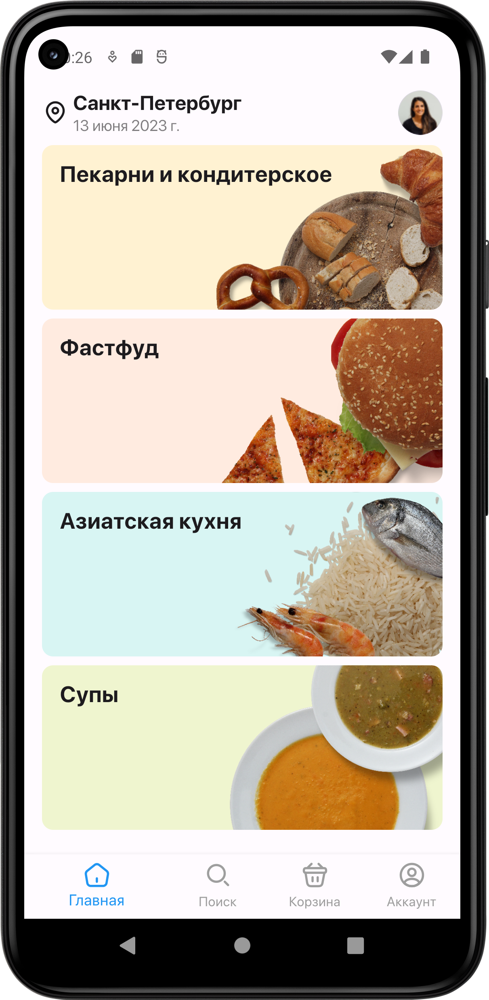
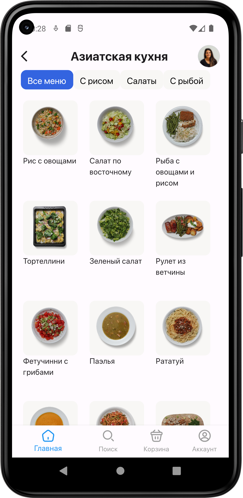
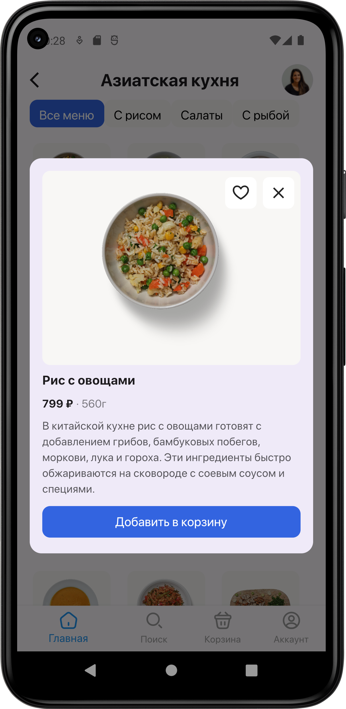
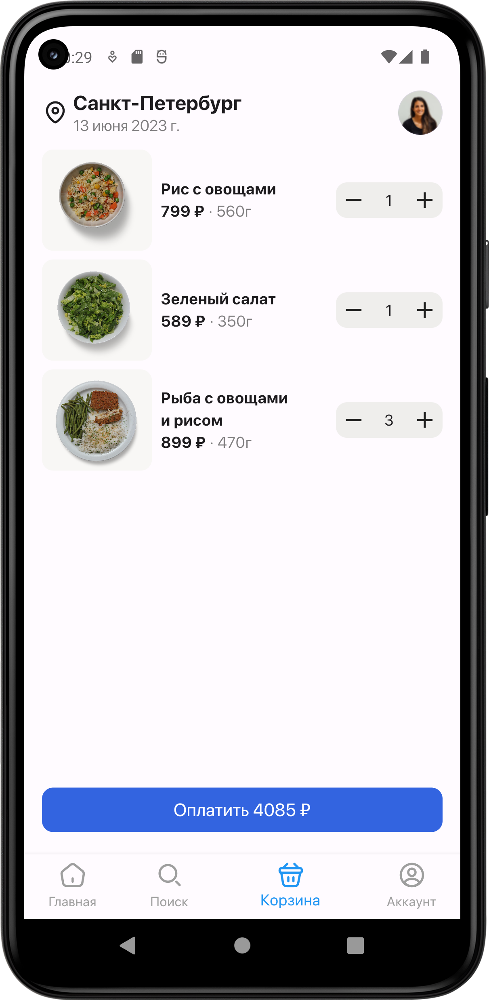

# test_jem

## Экраны из ТЗ

экран 1 ([lib/ui/screens/categories_screen.dart](lib/ui/screens/categories_screen.dart)):

экран 2 ([lib/ui/screens/dishes_screen.dart](lib/ui/screens/dishes_screen.dart)):

экран 3 ([lib/ui/screens/dish_dialog_screen.dart](lib/ui/screens/dish_dialog_screen.dart)):

экран 4 ([lib/ui/screens/shopping_cart_screen.dart](lib/ui/screens/shopping_cart_screen.dart)):

## Прочее

### Структура проекта

|директория|содержание|
|-|-|
|assets/fonts|шрифты и кастомные иконки|
|assets/images|изображения проекта (аватар из аппбара)|
|assets/screenshots|скриншоты и видео работы приложения|
|lib/bloc|блоки для страниц с категориями, с блюдами и с корзиной|
|lib/data/api_client|класс для вызова API (используя Retrofit)|
|lib/data/models|классы моделей для объектов, полученных от API, а также модели категории, блюда и корзины|
|lib/data/repositories|репозитории для данных от API и для корзины - с ними работают блоки|
|lib/ui/helpers|вспомогательные файлы с константами и данными о кастомных иконках|
|lib/ui/screens|все экраны приложения|
|lib/ui/widgets|виджеты для отдельных экранов и для нескольких экранов|
|integration_test|интеграционный тест|

### Тестирование

Добавлен интеграционный тест со сценариями из ТЗ, его работа записана в файле  assets/screenshots/Screen_Recording_20230613_201949.mp4

### Навигация

Используется Navigator 1.0.
Для каждой вкладки у виджета BottomNavigationBar ([custom_bottom_nav_bar.dart](lib/ui/widgets/custom_bottom_nav_bar.dart)) создаётся свой навигатор TabNavigator ([tab_navigator.dart](lib/ui/widgets/tab_navigator.dart)). Собственно создание этих навигаторов - [app.dart](lib/ui/screens/app.dart). 
Т.о. обеспечивается независимая навигация на вкладках, и при этом BottomNavigationBar остаётся постоянно на экране.